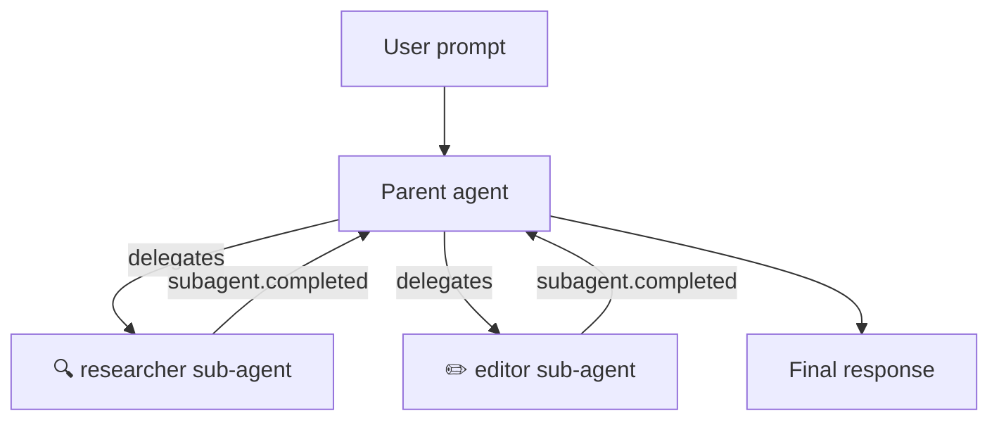

# Custom Agents & Sub-Agent Orchestration

Define specialized agents with scoped tools and prompts, then let Copilot orchestrate them as sub-agents within a single session.

## Overview

Custom agents are lightweight agent definitions you attach to a session. Each agent has its own system prompt, tool restrictions, and optional MCP servers. When a user's request matches an agent's expertise, the Copilot runtime automatically delegates to that agent as a **sub-agent** — running it in an isolated context while streaming lifecycle events back to the parent session.



| Concept | Description |
|---------|-------------|
| **Custom agent** | A named agent config with its own prompt and tool set |
| **Sub-agent** | A custom agent invoked by the runtime to handle part of a task |
| **Inference** | The runtime's ability to auto-select an agent based on the user's intent |
| **Parent session** | The session that spawned the sub-agent; receives all lifecycle events |

## Defining Custom Agents

Pass `customAgents` when creating a session. Each agent needs at minimum a `name` and `prompt`.

<details open>
<summary><strong>Node.js / TypeScript</strong></summary>

```typescript
import { CopilotClient } from "@github/copilot-sdk";

const client = new CopilotClient();
await client.start();

const session = await client.createSession({
    model: "gpt-4.1",
    customAgents: [
        {
            name: "researcher",
            displayName: "Research Agent",
            description: "Explores codebases and answers questions using read-only tools",
            tools: ["grep", "glob", "view"],
            prompt: "You are a research assistant. Analyze code and answer questions. Do not modify any files.",
        },
        {
            name: "editor",
            displayName: "Editor Agent",
            description: "Makes targeted code changes",
            tools: ["view", "edit", "bash"],
            prompt: "You are a code editor. Make minimal, surgical changes to files as requested.",
        },
    ],
    onPermissionRequest: async () => ({ kind: "approved" }),
});
```

</details>

<details>
<summary><strong>Python</strong></summary>

```python
from copilot import CopilotClient
from copilot.session import PermissionRequestResult

client = CopilotClient()
await client.start()

session = await client.create_session(
    on_permission_request=lambda req, inv: PermissionRequestResult(kind="approved"),
    model="gpt-4.1",
    custom_agents=[
        {
            "name": "researcher",
            "display_name": "Research Agent",
            "description": "Explores codebases and answers questions using read-only tools",
            "tools": ["grep", "glob", "view"],
            "prompt": "You are a research assistant. Analyze code and answer questions. Do not modify any files.",
        },
        {
            "name": "editor",
            "display_name": "Editor Agent",
            "description": "Makes targeted code changes",
            "tools": ["view", "edit", "bash"],
            "prompt": "You are a code editor. Make minimal, surgical changes to files as requested.",
        },
    ],
)
```

</details>

<details>
<summary><strong>Go</strong></summary>

<!-- docs-validate: hidden -->
```go
package main

import (
	"context"
	copilot "github.com/github/copilot-sdk/go"
)

func main() {
	ctx := context.Background()
	client := copilot.NewClient(nil)
	client.Start(ctx)

	session, _ := client.CreateSession(ctx, &copilot.SessionConfig{
		Model: "gpt-4.1",
		CustomAgents: []copilot.CustomAgentConfig{
			{
				Name:        "researcher",
				DisplayName: "Research Agent",
				Description: "Explores codebases and answers questions using read-only tools",
				Tools:       []string{"grep", "glob", "view"},
				Prompt:      "You are a research assistant. Analyze code and answer questions. Do not modify any files.",
			},
			{
				Name:        "editor",
				DisplayName: "Editor Agent",
				Description: "Makes targeted code changes",
				Tools:       []string{"view", "edit", "bash"},
				Prompt:      "You are a code editor. Make minimal, surgical changes to files as requested.",
			},
		},
		OnPermissionRequest: func(req copilot.PermissionRequest, inv copilot.PermissionInvocation) (copilot.PermissionRequestResult, error) {
			return copilot.PermissionRequestResult{Kind: copilot.PermissionRequestResultKindApproved}, nil
		},
	})
	_ = session
}
```
<!-- /docs-validate: hidden -->

```go
ctx := context.Background()
client := copilot.NewClient(nil)
client.Start(ctx)

session, _ := client.CreateSession(ctx, &copilot.SessionConfig{
    Model: "gpt-4.1",
    CustomAgents: []copilot.CustomAgentConfig{
        {
            Name:        "researcher",
            DisplayName: "Research Agent",
            Description: "Explores codebases and answers questions using read-only tools",
            Tools:       []string{"grep", "glob", "view"},
            Prompt:      "You are a research assistant. Analyze code and answer questions. Do not modify any files.",
        },
        {
            Name:        "editor",
            DisplayName: "Editor Agent",
            Description: "Makes targeted code changes",
            Tools:       []string{"view", "edit", "bash"},
            Prompt:      "You are a code editor. Make minimal, surgical changes to files as requested.",
        },
    },
    OnPermissionRequest: func(req copilot.PermissionRequest, inv copilot.PermissionInvocation) (copilot.PermissionRequestResult, error) {
        return copilot.PermissionRequestResult{Kind: copilot.PermissionRequestResultKindApproved}, nil
    },
})
```

</details>

<details>
<summary><strong>.NET</strong></summary>

```csharp
using GitHub.Copilot.SDK;

await using var client = new CopilotClient();
await using var session = await client.CreateSessionAsync(new SessionConfig
{
    Model = "gpt-4.1",
    CustomAgents = new List<CustomAgentConfig>
    {
        new()
        {
            Name = "researcher",
            DisplayName = "Research Agent",
            Description = "Explores codebases and answers questions using read-only tools",
            Tools = new List<string> { "grep", "glob", "view" },
            Prompt = "You are a research assistant. Analyze code and answer questions. Do not modify any files.",
        },
        new()
        {
            Name = "editor",
            DisplayName = "Editor Agent",
            Description = "Makes targeted code changes",
            Tools = new List<string> { "view", "edit", "bash" },
            Prompt = "You are a code editor. Make minimal, surgical changes to files as requested.",
        },
    },
    OnPermissionRequest = (req, inv) =>
        Task.FromResult(new PermissionRequestResult { Kind = PermissionRequestResultKind.Approved }),
});
```

</details>

## Configuration Reference

| Property | Type | Required | Description |
|----------|------|----------|-------------|
| `name` | `string` | ✅ | Unique identifier for the agent |
| `displayName` | `string` | | Human-readable name shown in events |
| `description` | `string` | | What the agent does — helps the runtime select it |
| `tools` | `string[]` or `null` | | Tool names the agent can use. `null` or omitted = all tools |
| `prompt` | `string` | ✅ | System prompt for the agent |
| `mcpServers` | `object` | | MCP server configurations specific to this agent |
| `infer` | `boolean` | | Whether the runtime can auto-select this agent (default: `true`) |
| `skills` | `string[]` | | List of skill names available to this agent |

> **Tip:** A good `description` helps the runtime match user intent to the right agent. Be specific about the agent's expertise and capabilities.

In addition to per-agent configuration above, you can set `agent` on the **session config** itself to pre-select which custom agent is active when the session starts. See [Selecting an Agent at Session Creation](#selecting-an-agent-at-session-creation) below.

| Session Config Property | Type | Description |
|-------------------------|------|-------------|
| `agent` | `string` | Name of the custom agent to pre-select at session creation. Must match a `name` in `customAgents`. |

## Per-Agent Skills

You can scope skills to individual agents using the `skills` property. Skills are **opt-in** — agents have no access to skills by default. The skill names listed in `skills` are resolved from the session-level `skillDirectories`.

```typescript
const session = await client.createSession({
    skillDirectories: ["./skills"],
    customAgents: [
        {
            name: "security-auditor",
            description: "Security-focused code reviewer",
            prompt: "Focus on OWASP Top 10 vulnerabilities",
            skills: ["security-scan", "dependency-check"],
        },
        {
            name: "docs-writer",
            description: "Technical documentation writer",
            prompt: "Write clear, concise documentation",
            skills: ["markdown-lint"],
        },
    ],
    onPermissionRequest: async () => ({ kind: "approved" }),
});
```

In this example, `security-auditor` can invoke only `security-scan` and `dependency-check`, while `docs-writer` can invoke only `markdown-lint`. An agent without a `skills` field has no access to any skills.

## Selecting an Agent at Session Creation

You can pass `agent` in the session config to pre-select which custom agent should be active when the session starts. The value must match the `name` of one of the agents defined in `customAgents`.

This is equivalent to calling `session.rpc.agent.select()` after creation, but avoids the extra API call and ensures the agent is active from the very first prompt.

<details open>
<summary><strong>Node.js / TypeScript</strong></summary>

<!-- docs-validate: skip -->
```typescript
const session = await client.createSession({
    customAgents: [
        {
            name: "researcher",
            prompt: "You are a research assistant. Analyze code and answer questions.",
        },
        {
            name: "editor",
            prompt: "You are a code editor. Make minimal, surgical changes.",
        },
    ],
    agent: "researcher", // Pre-select the researcher agent
});
```

</details>

<details>
<summary><strong>Python</strong></summary>

<!-- docs-validate: skip -->
```python
session = await client.create_session(
    on_permission_request=PermissionHandler.approve_all,
    custom_agents=[
        {
            "name": "researcher",
            "prompt": "You are a research assistant. Analyze code and answer questions.",
        },
        {
            "name": "editor",
            "prompt": "You are a code editor. Make minimal, surgical changes.",
        },
    ],
    agent="researcher",  # Pre-select the researcher agent
)
```

</details>

<details>
<summary><strong>Go</strong></summary>

<!-- docs-validate: skip -->
```go
session, _ := client.CreateSession(ctx, &copilot.SessionConfig{
    CustomAgents: []copilot.CustomAgentConfig{
        {
            Name:   "researcher",
            Prompt: "You are a research assistant. Analyze code and answer questions.",
        },
        {
            Name:   "editor",
            Prompt: "You are a code editor. Make minimal, surgical changes.",
        },
    },
    Agent: "researcher", // Pre-select the researcher agent
})
```

</details>

<details>
<summary><strong>.NET</strong></summary>

<!-- docs-validate: skip -->
```csharp
var session = await client.CreateSessionAsync(new SessionConfig
{
    CustomAgents = new List<CustomAgentConfig>
    {
        new() { Name = "researcher", Prompt = "You are a research assistant. Analyze code and answer questions." },
        new() { Name = "editor", Prompt = "You are a code editor. Make minimal, surgical changes." },
    },
    Agent = "researcher", // Pre-select the researcher agent
});
```

</details>

## How Sub-Agent Delegation Works

When you send a prompt to a session with custom agents, the runtime evaluates whether to delegate to a sub-agent:

1. **Intent matching** — The runtime analyzes the user's prompt against each agent's `name` and `description`
2. **Agent selection** — If a match is found and `infer` is not `false`, the runtime selects the agent
3. **Isolated execution** — The sub-agent runs with its own prompt and restricted tool set
4. **Event streaming** — Lifecycle events (`subagent.started`, `subagent.completed`, etc.) stream back to the parent session
5. **Result integration** — The sub-agent's output is incorporated into the parent agent's response

### Controlling Inference

By default, all custom agents are available for automatic selection (`infer: true`). Set `infer: false` to prevent the runtime from auto-selecting an agent — useful for agents you only want invoked through explicit user requests:

```typescript
{
    name: "dangerous-cleanup",
    description: "Deletes unused files and dead code",
    tools: ["bash", "edit", "view"],
    prompt: "You clean up codebases by removing dead code and unused files.",
    infer: false, // Only invoked when user explicitly asks for this agent
}
```

## Listening to Sub-Agent Events

When a sub-agent runs, the parent session emits lifecycle events. Subscribe to these events to build UIs that visualize agent activity.

### Event Types

| Event | Emitted when | Data |
|-------|-------------|------|
| `subagent.selected` | Runtime selects an agent for the task | `agentName`, `agentDisplayName`, `tools` |
| `subagent.started` | Sub-agent begins execution | `toolCallId`, `agentName`, `agentDisplayName`, `agentDescription` |
| `subagent.completed` | Sub-agent finishes successfully | `toolCallId`, `agentName`, `agentDisplayName` |
| `subagent.failed` | Sub-agent encounters an error | `toolCallId`, `agentName`, `agentDisplayName`, `error` |
| `subagent.deselected` | Runtime switches away from the sub-agent | — |

### Subscribing to Events

<details open>
<summary><strong>Node.js / TypeScript</strong></summary>

```typescript
session.on((event) => {
    switch (event.type) {
        case "subagent.started":
            console.log(`▶ Sub-agent started: ${event.data.agentDisplayName}`);
            console.log(`  Description: ${event.data.agentDescription}`);
            console.log(`  Tool call ID: ${event.data.toolCallId}`);
            break;

        case "subagent.completed":
            console.log(`✅ Sub-agent completed: ${event.data.agentDisplayName}`);
            break;

        case "subagent.failed":
            console.log(`❌ Sub-agent failed: ${event.data.agentDisplayName}`);
            console.log(`  Error: ${event.data.error}`);
            break;

        case "subagent.selected":
            console.log(`🎯 Agent selected: ${event.data.agentDisplayName}`);
            console.log(`  Tools: ${event.data.tools?.join(", ") ?? "all"}`);
            break;

        case "subagent.deselected":
            console.log("↩ Agent deselected, returning to parent");
            break;
    }
});

const response = await session.sendAndWait({
    prompt: "Research how authentication works in this codebase",
});
```

</details>

<details>
<summary><strong>Python</strong></summary>

```python
def handle_event(event):
    if event.type == "subagent.started":
        print(f"▶ Sub-agent started: {event.data.agent_display_name}")
        print(f"  Description: {event.data.agent_description}")
    elif event.type == "subagent.completed":
        print(f"✅ Sub-agent completed: {event.data.agent_display_name}")
    elif event.type == "subagent.failed":
        print(f"❌ Sub-agent failed: {event.data.agent_display_name}")
        print(f"  Error: {event.data.error}")
    elif event.type == "subagent.selected":
        tools = event.data.tools or "all"
        print(f"🎯 Agent selected: {event.data.agent_display_name} (tools: {tools})")

unsubscribe = session.on(handle_event)

response = await session.send_and_wait("Research how authentication works in this codebase")
```

</details>

<details>
<summary><strong>Go</strong></summary>

<!-- docs-validate: hidden -->
```go
package main

import (
	"context"
	"fmt"
	copilot "github.com/github/copilot-sdk/go"
)

func main() {
	ctx := context.Background()
	client := copilot.NewClient(nil)
	client.Start(ctx)

	session, _ := client.CreateSession(ctx, &copilot.SessionConfig{
		Model: "gpt-4.1",
		OnPermissionRequest: func(req copilot.PermissionRequest, inv copilot.PermissionInvocation) (copilot.PermissionRequestResult, error) {
			return copilot.PermissionRequestResult{Kind: copilot.PermissionRequestResultKindApproved}, nil
		},
	})

	session.On(func(event copilot.SessionEvent) {
		switch event.Type {
		case "subagent.started":
			fmt.Printf("▶ Sub-agent started: %s\n", *event.Data.AgentDisplayName)
			fmt.Printf("  Description: %s\n", *event.Data.AgentDescription)
			fmt.Printf("  Tool call ID: %s\n", *event.Data.ToolCallID)
		case "subagent.completed":
			fmt.Printf("✅ Sub-agent completed: %s\n", *event.Data.AgentDisplayName)
		case "subagent.failed":
			fmt.Printf("❌ Sub-agent failed: %s — %v\n", *event.Data.AgentDisplayName, event.Data.Error)
		case "subagent.selected":
			fmt.Printf("🎯 Agent selected: %s\n", *event.Data.AgentDisplayName)
		}
	})

	_, err := session.SendAndWait(ctx, copilot.MessageOptions{
		Prompt: "Research how authentication works in this codebase",
	})
	_ = err
}
```
<!-- /docs-validate: hidden -->

```go
session.On(func(event copilot.SessionEvent) {
    switch event.Type {
    case "subagent.started":
        fmt.Printf("▶ Sub-agent started: %s\n", *event.Data.AgentDisplayName)
        fmt.Printf("  Description: %s\n", *event.Data.AgentDescription)
        fmt.Printf("  Tool call ID: %s\n", *event.Data.ToolCallID)
    case "subagent.completed":
        fmt.Printf("✅ Sub-agent completed: %s\n", *event.Data.AgentDisplayName)
    case "subagent.failed":
        fmt.Printf("❌ Sub-agent failed: %s — %v\n", *event.Data.AgentDisplayName, event.Data.Error)
    case "subagent.selected":
        fmt.Printf("🎯 Agent selected: %s\n", *event.Data.AgentDisplayName)
    }
})

_, err := session.SendAndWait(ctx, copilot.MessageOptions{
    Prompt: "Research how authentication works in this codebase",
})
```

</details>

<details>
<summary><strong>.NET</strong></summary>

<!-- docs-validate: hidden -->
```csharp
using GitHub.Copilot.SDK;

public static class SubAgentEventsExample
{
    public static async Task Example(CopilotSession session)
    {
        using var subscription = session.On(evt =>
        {
            switch (evt)
            {
                case SubagentStartedEvent started:
                    Console.WriteLine($"▶ Sub-agent started: {started.Data.AgentDisplayName}");
                    Console.WriteLine($"  Description: {started.Data.AgentDescription}");
                    Console.WriteLine($"  Tool call ID: {started.Data.ToolCallId}");
                    break;
                case SubagentCompletedEvent completed:
                    Console.WriteLine($"✅ Sub-agent completed: {completed.Data.AgentDisplayName}");
                    break;
                case SubagentFailedEvent failed:
                    Console.WriteLine($"❌ Sub-agent failed: {failed.Data.AgentDisplayName} — {failed.Data.Error}");
                    break;
                case SubagentSelectedEvent selected:
                    Console.WriteLine($"🎯 Agent selected: {selected.Data.AgentDisplayName}");
                    break;
            }
        });

        await session.SendAndWaitAsync(new MessageOptions
        {
            Prompt = "Research how authentication works in this codebase"
        });
    }
}
```
<!-- /docs-validate: hidden -->

```csharp
using var subscription = session.On(evt =>
{
    switch (evt)
    {
        case SubagentStartedEvent started:
            Console.WriteLine($"▶ Sub-agent started: {started.Data.AgentDisplayName}");
            Console.WriteLine($"  Description: {started.Data.AgentDescription}");
            Console.WriteLine($"  Tool call ID: {started.Data.ToolCallId}");
            break;
        case SubagentCompletedEvent completed:
            Console.WriteLine($"✅ Sub-agent completed: {completed.Data.AgentDisplayName}");
            break;
        case SubagentFailedEvent failed:
            Console.WriteLine($"❌ Sub-agent failed: {failed.Data.AgentDisplayName} — {failed.Data.Error}");
            break;
        case SubagentSelectedEvent selected:
            Console.WriteLine($"🎯 Agent selected: {selected.Data.AgentDisplayName}");
            break;
    }
});

await session.SendAndWaitAsync(new MessageOptions
{
    Prompt = "Research how authentication works in this codebase"
});
```

</details>

## Building an Agent Tree UI

Sub-agent events include `toolCallId` fields that let you reconstruct the execution tree. Here's a pattern for tracking agent activity:

```typescript
interface AgentNode {
    toolCallId: string;
    name: string;
    displayName: string;
    status: "running" | "completed" | "failed";
    error?: string;
    startedAt: Date;
    completedAt?: Date;
}

const agentTree = new Map<string, AgentNode>();

session.on((event) => {
    if (event.type === "subagent.started") {
        agentTree.set(event.data.toolCallId, {
            toolCallId: event.data.toolCallId,
            name: event.data.agentName,
            displayName: event.data.agentDisplayName,
            status: "running",
            startedAt: new Date(event.timestamp),
        });
    }

    if (event.type === "subagent.completed") {
        const node = agentTree.get(event.data.toolCallId);
        if (node) {
            node.status = "completed";
            node.completedAt = new Date(event.timestamp);
        }
    }

    if (event.type === "subagent.failed") {
        const node = agentTree.get(event.data.toolCallId);
        if (node) {
            node.status = "failed";
            node.error = event.data.error;
            node.completedAt = new Date(event.timestamp);
        }
    }

    // Render your UI with the updated tree
    renderAgentTree(agentTree);
});
```

## Scoping Tools per Agent

Use the `tools` property to restrict which tools an agent can access. This is essential for security and for keeping agents focused:

```typescript
const session = await client.createSession({
    customAgents: [
        {
            name: "reader",
            description: "Read-only exploration of the codebase",
            tools: ["grep", "glob", "view"],  // No write access
            prompt: "You explore and analyze code. Never suggest modifications directly.",
        },
        {
            name: "writer",
            description: "Makes code changes",
            tools: ["view", "edit", "bash"],   // Write access
            prompt: "You make precise code changes as instructed.",
        },
        {
            name: "unrestricted",
            description: "Full access agent for complex tasks",
            tools: null,                        // All tools available
            prompt: "You handle complex multi-step tasks using any available tools.",
        },
    ],
});
```

> **Note:** When `tools` is `null` or omitted, the agent inherits access to all tools configured on the session. Use explicit tool lists to enforce the principle of least privilege.

## Attaching MCP Servers to Agents

Each custom agent can have its own MCP (Model Context Protocol) servers, giving it access to specialized data sources:

```typescript
const session = await client.createSession({
    customAgents: [
        {
            name: "db-analyst",
            description: "Analyzes database schemas and queries",
            prompt: "You are a database expert. Use the database MCP server to analyze schemas.",
            mcpServers: {
                "database": {
                    command: "npx",
                    args: ["-y", "@modelcontextprotocol/server-postgres", "postgresql://localhost/mydb"],
                },
            },
        },
    ],
});
```

## Patterns & Best Practices

### Pair a researcher with an editor

A common pattern is to define a read-only researcher agent and a write-capable editor agent. The runtime delegates exploration tasks to the researcher and modification tasks to the editor:

```typescript
customAgents: [
    {
        name: "researcher",
        description: "Analyzes code structure, finds patterns, and answers questions",
        tools: ["grep", "glob", "view"],
        prompt: "You are a code analyst. Thoroughly explore the codebase to answer questions.",
    },
    {
        name: "implementer",
        description: "Implements code changes based on analysis",
        tools: ["view", "edit", "bash"],
        prompt: "You make minimal, targeted code changes. Always verify changes compile.",
    },
]
```

### Keep agent descriptions specific

The runtime uses the `description` to match user intent. Vague descriptions lead to poor delegation:

```typescript
// ❌ Too vague — runtime can't distinguish from other agents
{ description: "Helps with code" }

// ✅ Specific — runtime knows when to delegate
{ description: "Analyzes Python test coverage and identifies untested code paths" }
```

### Handle failures gracefully

Sub-agents can fail. Always listen for `subagent.failed` events and handle them in your application:

```typescript
session.on((event) => {
    if (event.type === "subagent.failed") {
        logger.error(`Agent ${event.data.agentName} failed: ${event.data.error}`);
        // Show error in UI, retry, or fall back to parent agent
    }
});
```
